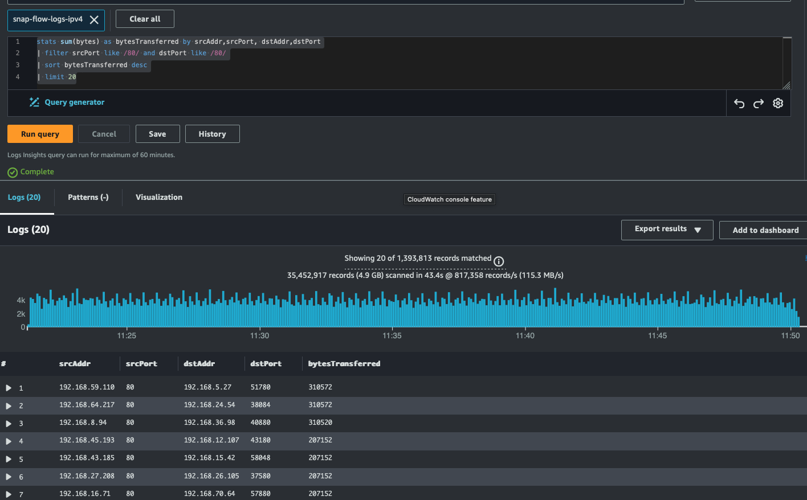
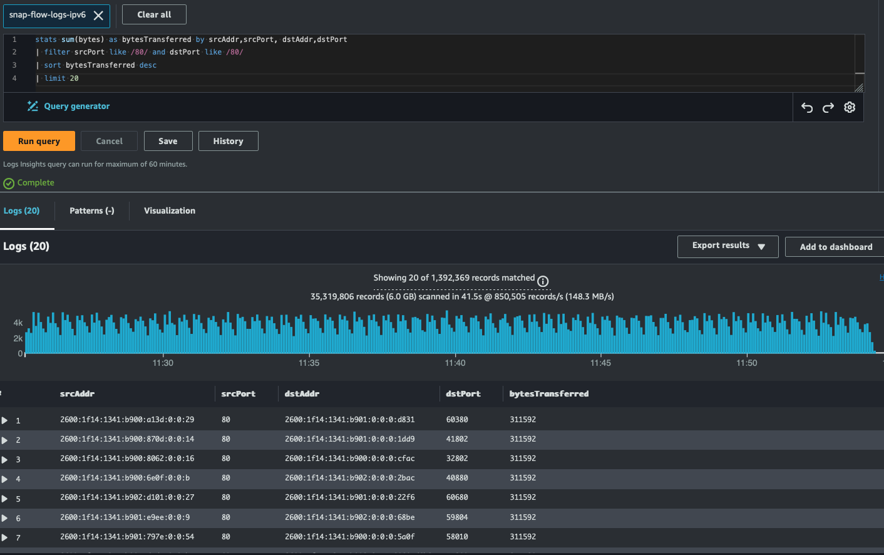
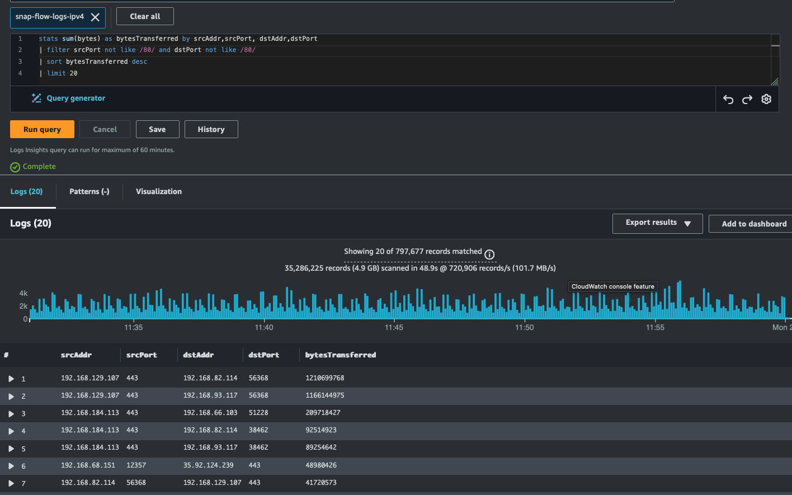
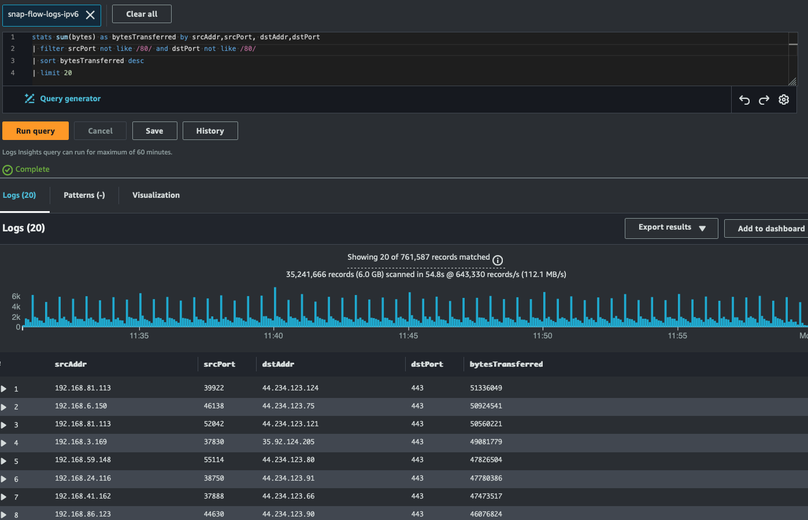

# congenial-ipv6-machine
benchmarking inter-az dto with http

We simulated inter-AZ data transfer by performing HTTP GET requests against a cluster of Apache HTTP servers through an internal K8s service load balancer.

### Deploy two clusters with single managed node group each configured with 100 m5.4xl; one with ipv4 and the other with ipv6
- addons: kube-proxy (v1.29.0-eksbuild.1) , CoreDNS (v1.11.1-eksbuild.4), Amazon EKS Pod Identity Agent (v1.3.2-eksbuild.2), Amazon CloudWatch Observability (v2.1.3-eksbuild.1)
### Deploy apache server with k8s internal service
ipv4 - `kubectl apply -f apache-deploy-ipv4.yaml`
ipv6 - `kubectl apply -f apache-deploy-ipv6.yaml`
### Deploy curl clients 
ipv4 - `kubectl apply -f curl-deploy-ipv4.yaml`
ipv6 - `kubectl apply -f curl-deploy-ipv6.yaml`
### Set the managed node groups size on both clusters to 110; run on both clusters
```
kubectl get no -L beta.kubernetes.io/instance-type| awk '{print $NF}'| sort | uniq -c
   1 INSTANCE-TYPE
 108 m5.4xlarge
   2 m5.xlarge
```
### Let the baseline load shapes run for at least 30 minutes to allow enough data

```
congenial-ipv6-machine]$kubectl config use-context yahavb@ipv6-usw2.us-west-2.eksctl.io 
Switched to context "yahavb@ipv6-usw2.us-west-2.eksctl.io".
[congenial-ipv6-machine]$kubectl get deploy
NAME                READY       UP-TO-DATE   AVAILABLE   AGE
apache-deployment   500/500     500          500         20h
curl-deployment     5000/5000   5000         5000        20h
[congenial-ipv6-machine]$kubectl get po | awk '{print $3}'| sort | uniq -c
5500 Running
   1 STATUS
kubectl get no -L beta.kubernetes.io/instance-type| awk '{print $NF}'| sort | uniq -c
   1 INSTANCE-TYPE
 108 m5.4xlarge
   2 m5.xlarge
[congenial-ipv6-machine]$kubectl config use-context yahavb@ipv4-usw2.us-west-2.eksctl.io 
Switched to context "yahavb@ipv4-usw2.us-west-2.eksctl.io".
[congenial-ipv6-machine]$kubectl get deploy
NAME                READY       UP-TO-DATE   AVAILABLE   AGE
apache-deployment   500/500     500          500         24h
curl-deployment     5000/5000   5000         5000        24h
[congenial-ipv6-machine]$kubectl get po | awk '{print $3}'| sort | uniq -c
5500 Running
   1 STATUS
kubectl get no -L beta.kubernetes.io/instance-type| awk '{print $NF}'| sort | uniq -c
   1 INSTANCE-TYPE
 108 m5.4xlarge
   2 m5.xlarge
```

### Use your preferred observability tool, in our case Amazon CloudWatch Observability, to discover `pod_network_tx_bytes` and `pod_network_rx_bytes` for each cluster deployment, both for IPv4 and IPv6 traffic.
Ensure that the `tx` and `rx` rates on both the server and client for IPv4 and IPv6 are comparable before analyzing data transfer costs.


### Enable flow logs for both VPCs of the two clusters to CloudWatch Logs, so we can run Log Insights statistics to identify the top network producers and consumers.
for each of the vpc flow logs, pull the the top `srcAddr,srcPort,dstAddr,dstPort` as follow:

```
stats sum(bytes) as bytesTransferred by srcAddr,srcPort, dstAddr,dstPort
| filter srcPort like /80/ and dstPort like /80/
| sort bytesTransferred desc
| limit 20
```
note that we first want to compre the traffic from and to the curl client to the apache server hence the filter.





top bytesTransferred in both cases are in the rnge of ~300K bytes.

Now we observe the top network producers and conseumers that are not related to the apache server and curl client.





Here we found that traffic flows from and to and endpoint that listens on port 443 so we logged into one of the nodes to find the application that started the 443 socket server. 

ipv4 node sample:
```
h-4.2$ sudo su
[root@ip-192-168-93-117 bin]# netstat -anp | grep 443
tcp        0      0 192.168.93.117:41850    35.92.124.211:443       ESTABLISHED 5341/fluent-bit
tcp        0      0 192.168.93.117:52412    35.92.124.210:443       ESTABLISHED 5341/fluent-bit
tcp        0      0 192.168.93.117:60416    44.234.123.121:443      ESTABLISHED 5341/fluent-bit
tcp        0      0 192.168.93.117:52418    35.92.124.210:443       ESTABLISHED 5341/fluent-bit
tcp        0      0 192.168.93.117:59278    52.94.185.41:443        ESTABLISHED 4033/ssm-agent-work
tcp        0      0 192.168.93.117:58692    44.234.123.100:443      ESTABLISHED 5341/fluent-bit
tcp        0      0 192.168.93.117:49960    10.100.0.1:443          ESTABLISHED 5342/amazon-cloudwa
tcp        0      0 192.168.93.117:55294    52.94.178.57:443        ESTABLISHED 838383/ssm-session-
tcp        0      0 192.168.93.117:34216    44.234.123.115:443      ESTABLISHED 5341/fluent-bit
tcp        0      0 192.168.93.117:51246    52.40.7.92:443          ESTABLISHED 4958/kube-proxy
tcp        0      0 192.168.93.117:42812    52.41.75.164:443        ESTABLISHED 4534/kubelet
tcp        0      0 192.168.93.117:45612    10.100.0.1:443          ESTABLISHED 6153/controller
tcp        0      0 192.168.93.117:45624    10.100.0.1:443          ESTABLISHED 5574/./aws-k8s-agen
tcp        0    269 192.168.93.117:55298    52.94.178.57:443        ESTABLISHED 838383/ssm-session-
```

ipv6 node sample:
```
h-4.2$ sudo su
[root@ip-192-168-94-30 bin]# netstat -anp | grep 443
tcp        0      0 192.168.94.30:59790     35.166.130.238:443      ESTABLISHED 5635/./aws-k8s-agen
tcp        0      0 192.168.94.30:55848     52.94.186.93:443        ESTABLISHED 2524474/ssm-session
tcp        0      0 192.168.94.30:38500     44.234.123.86:443       ESTABLISHED 5470/fluent-bit
tcp        0      0 192.168.94.30:44906     54.202.242.131:443      ESTABLISHED 4565/kubelet
tcp        0      0 192.168.94.30:54300     44.234.123.111:443      TIME_WAIT   -
tcp        0      0 192.168.94.30:38592     35.166.130.238:443      ESTABLISHED 4957/kube-proxy
tcp        0      0 192.168.94.30:47050     35.92.124.205:443       ESTABLISHED 5470/fluent-bit
tcp        0      0 192.168.94.30:54276     44.234.123.111:443      ESTABLISHED 5470/fluent-bit
tcp        0      0 192.168.94.30:55854     52.94.186.93:443        ESTABLISHED 2524474/ssm-session
tcp        0      0 192.168.94.30:47038     35.92.124.205:443       ESTABLISHED 5470/fluent-bit
tcp        0      0 192.168.94.30:53102     52.94.185.31:443        ESTABLISHED 4066/ssm-agent-work
tcp        0      0 192.168.94.30:54298     44.234.123.111:443      ESTABLISHED 5470/fluent-bit
tcp        0      0 192.168.94.30:47030     35.92.124.205:443       ESTABLISHED 5470/fluent-bit
tcp        0      0 192.168.94.30:50602     44.234.123.84:443       ESTABLISHED 5470/fluent-bit
tcp        0      0 192.168.94.30:50596     44.234.123.84:443       ESTABLISHED 5470/fluent-bit
tcp        0      0 192.168.94.30:44034     44.234.123.106:443      ESTABLISHED 5470/fluent-bit
tcp        0      0 192.168.94.30:54292     44.234.123.111:443      ESTABLISHED 5470/fluent-bit
tcp6       0      0 2600:1f14:1341:b9:49646 fdf0:bc1a:445e::1:443   ESTABLISHED 5939/amazon-cloudwa
tcp6       0      0 2600:1f14:1341:b9:45000 fdf0:bc1a:445e::1:443   ESTABLISHED 5796/controller
unix  3      [ ]         DGRAM                    14435    1/systemd            /run/systemd/notify
unix  2      [ ]         DGRAM                    14436    1/systemd            /run/systemd/cgroups-agent
unix  15     [ ]         DGRAM                    14443    1/systemd            /dev/log
unix  3      [ ]         STREAM     CONNECTED     51359443 4384/containerd
[root@ip-192-168-94-30 bin]#
```

In both cases, 443 is served for fluent-bit, the tool we uses to stream logs to cloudwatch logs. We found that in the case of ipv4, the endpoint being used is internal IP, e.g., `192.168.93.117` and in the ipv6, it uses external `dstAddr` like `44.234.123.124`
TBD - how to configure fluent-bit endpoint
