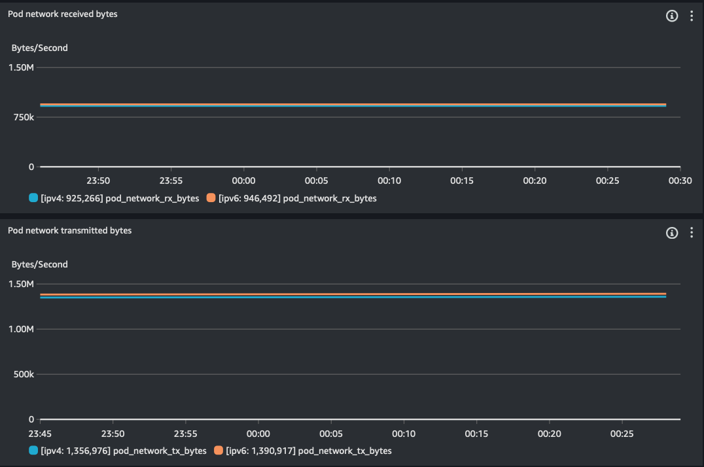

# congenial-ipv6-machine
benchmarking inter-az dto with http

We simulated inter-AZ data transfer by performing HTTP GET requests against a cluster of Apache HTTP servers through an internal K8s service load balancer.

### Deploy two clusters with single managed node group each configured with 100 m5.4xl; one with ipv4 and the other with ipv6
- addons: kube-proxy (v1.29.0-eksbuild.1) , CoreDNS (v1.11.1-eksbuild.4), Amazon EKS Pod Identity Agent (v1.3.2-eksbuild.2), Amazon CloudWatch Observability (v2.1.3-eksbuild.1)
### Deploy apache server with k8s internal service
ipv4 - `kubectl apply -f apache-deploy-ipv4.yaml`
ipv6 - `kubectl apply -f apache-deploy-ipv6.yaml`
### Deploy curl clients 
ipv4 - `kubectl apply -f curl-deploy-ipv4.yaml`
ipv6 - `kubectl apply -f curl-deploy-ipv6.yaml`
### Set the managed node groups size on both clusters to 110; run on both clusters
```
kubectl get no -L beta.kubernetes.io/instance-type| awk '{print $NF}'| sort | uniq -c
   1 INSTANCE-TYPE
 108 m5.4xlarge
   2 m5.xlarge
```
### Let the baseline load shapes run for at least 30 minutes to allow enough data

```
congenial-ipv6-machine]$kubectl config use-context yahavb@ipv6-usw2.us-west-2.eksctl.io 
Switched to context "yahavb@ipv6-usw2.us-west-2.eksctl.io".
[congenial-ipv6-machine]$kubectl get deploy
NAME                READY       UP-TO-DATE   AVAILABLE   AGE
apache-deployment   500/500     500          500         20h
curl-deployment     5000/5000   5000         5000        20h
[congenial-ipv6-machine]$kubectl get po | awk '{print $3}'| sort | uniq -c
5500 Running
   1 STATUS
kubectl get no -L beta.kubernetes.io/instance-type| awk '{print $NF}'| sort | uniq -c
   1 INSTANCE-TYPE
 108 m5.4xlarge
   2 m5.xlarge
[congenial-ipv6-machine]$kubectl config use-context yahavb@pv4-usw2.us-west-2.eksctl.io 
Switched to context "yahavb@ipv4-usw2.us-west-2.eksctl.io".
[congenial-ipv6-machine]$kubectl get deploy
NAME                READY       UP-TO-DATE   AVAILABLE   AGE
apache-deployment   500/500     500          500         24h
curl-deployment     5000/5000   5000         5000        24h
[congenial-ipv6-machine]$kubectl get po | awk '{print $3}'| sort | uniq -c
5500 Running
   1 STATUS
kubectl get no -L beta.kubernetes.io/instance-type| awk '{print $NF}'| sort | uniq -c
   1 INSTANCE-TYPE
 108 m5.4xlarge
   2 m5.xlarge
```

### Use your preferred observability tool, in our case Amazon CloudWatch Observability, to discover `pod_network_tx_bytes` and `pod_network_rx_bytes` for each cluster deployment, both for IPv4 and IPv6 traffic.
Ensure that the `tx` and `rx` rates on both the server and client for IPv4 and IPv6 are comparable before analyzing data transfer costs.


### Enable flow logs for both VPCs of the two clusters to CloudWatch Logs, so we can run Log Insights statistics to identify the top network producers and consumers.


